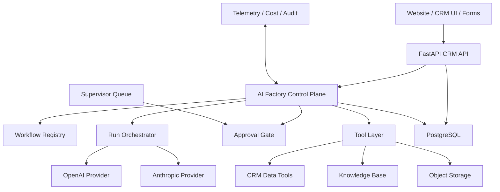

# AI Factory Architecture

## Purpose

AI Factory is the control plane that turns Desir Consultant LLC from a CRM-backed consulting business into an auditable, low-supervision operating system.

Phase 2 in this repository establishes:

- separated auth for JWT signing vs service automation
- provider-ready configuration for OpenAI and Anthropic
- Postgres-backed AI workflows, runs, tasks, approvals, tool calls, cost ledger, and incident tracking
- Redis-backed worker execution for AI runs
- OpenTelemetry export to an OTLP collector
- safe first workflows: lead qualification and proposal drafting, each with required human approval before protected CRM write-back

It does not yet make the company fully autonomous.

## Customer-Facing Trust Layer

The AI control plane is only one part of launch readiness. Customer-facing trust and procurement artifacts now live in:

- `TRUST_PACKAGE.md`
- `docs/security/SECURITY_OVERVIEW.md`
- `docs/security/INCIDENT_NOTIFICATION_POLICY.md`
- `docs/security/SUBPROCESSORS.md`

Those documents should be used to describe the current operating posture without overstating automation scope.

## Target Layout

## Current Runtime Placement

Today, AI Factory runs inside the existing Compose stack:

- API root: `crm-project-Desir-Tech/backend/app/main.py`
- control-plane routes: `crm-project-Desir-Tech/backend/app/routes/ai_factory.py`
- control-plane ORM: `crm-project-Desir-Tech/backend/app/models.py`
- worker entrypoint: `crm-project-Desir-Tech/backend/app/worker.py`
- queue and provider adapters: `crm-project-Desir-Tech/backend/app/ai_factory_queue.py`, `crm-project-Desir-Tech/backend/app/ai_providers.py`
- canonical schema: `db/sql/01_full_schema.sql`

This is intentional for the current validation stage. It keeps deployment simple while the first workflow is validated under supervisor review.

## Core Components

### 1. Control Plane

The control plane owns:

- workflow definitions
- run creation and tracking
- agent task sequencing
- approval requests and decisions
- tool-call and cost audit logs
- incident records

### 2. Tool Layer

Models must not touch the database directly. They should only act through audited tools.

Initial tool domains:

- lead read / enrichment request
- client read
- opportunity create after approval
- contractor search
- proposal draft generation
- project health summary
- invoice status read

### 3. Provider Gateway

The provider layer abstracts OpenAI and Anthropic behind one internal interface:

- `plan`
- `run_step`
- `tool_call`
- `structured_output`
- `stream`

Recommended routing:

- OpenAI primary for orchestration and tool-heavy flows
- Anthropic secondary for benchmark, fallback, or specific document-heavy tasks

### 4. Human Approval Gate

Human approval remains mandatory for:

- outbound email
- proposal release
- contractor outreach
- contract creation or release
- invoice mutation
- payment activity
- CRM write-back with legal or revenue impact
- contract generation or release remains human-controlled even when draft assistance exists

### 5. Observability

Every run must emit:

- run id
- workflow id and version
- provider and model
- token and cost attribution
- tool usage
- approval path
- resulting business write-back
- incident markers

## Phase 0-1 Workflow

### Lead Qualification with Human Approval

Run path:

1. Intake Normalizer
2. Qualification Agent
3. Sales Supervisor Gate
4. CRM Write-back after approval only

Business effect in phase 1:

- high or medium quality leads can create or link an opportunity
- low quality leads remain as leads
- no outbound communication is sent automatically

## Infrastructure Direction

### Current

- OCI VM
- Docker Compose
- nginx + FastAPI + PostgreSQL
- GitHub Actions deploy over SSH

### Current Runtime Services

- `backend`
- `ai-worker`
- `redis`
- `otel-collector`

### Next Hardening Step

Add the following after the current queue-backed workflow proves reliable under supervisor review:

- object storage for long-lived artifacts
- retrieval pipeline for resumes, SOWs, contracts, and proposals
- alert ownership, dashboarding, and KPI review cadence
- customer-ready agreement governance with counsel approval before execution

## Minimal Human Supervisor Model

Desir Consultant can move toward low-supervision operation with three human roles:

- Business Supervisor: approves revenue, legal, and staffing actions
- Delivery Supervisor: handles exceptions, project risk, and client escalations
- Platform Owner: manages prompts, models, keys, policies, and incidents

Everything else should trend toward automation.

## Hardening Checklist

1. Rotate all compromised or previously committed credentials immediately.
2. Enforce branch protection and PR-based deploy flow for `main`.
3. Keep JWT signing and automation API keys separate.
4. Require database-backed workflow configs instead of hard-coded AI payloads.
5. Keep queue processing isolated from the API path and monitor backlog growth.
6. Add eval suites before allowing autonomous write actions beyond approved lead qualification.
7. Add object storage and retrieval before document-heavy proposal or legal workflows.
8. Add per-client cost and usage dashboards before scaling provider traffic.
9. Add incident response paths for hallucination, bad write-back, and provider outage.
10. Keep a strict deny-by-default tool policy for every workflow.
